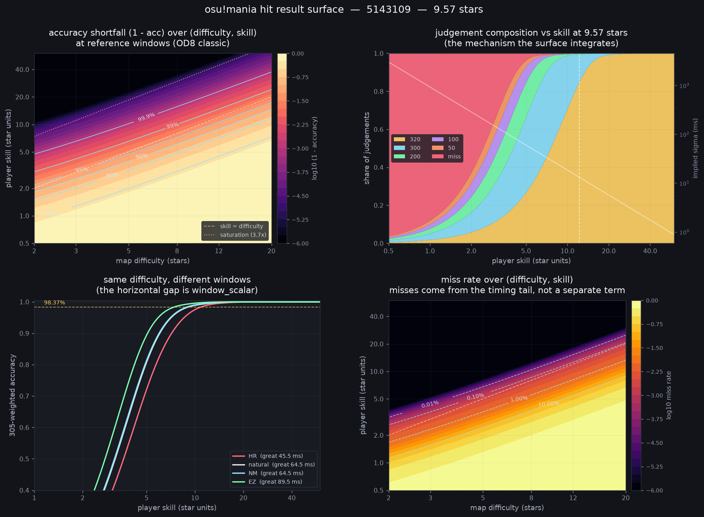

# Mania Hit Result Surface 与输入状态模型报告

> 对比基线：`main`  
> 当前分支：`experiment/mania-natural-window-surface`  
> 报告日期：2026-09-02

## 1. 结论摘要

这组修改的核心，是让 Mania PP 不再只看一个总 accuracy 和一条固定的 OD 修正，而是读取完整的 **320 / 300 / 200 / 100 / 50 / miss 分布**，再结合谱面的实际判定窗口、每个音符的局部难度、LN 结构和同列连续按键状态，推断这次成绩体现出的 timing skill。

主要变化可以概括为：

1. **Hit result surface**：相同 accuracy 但判定组成不同的成绩，不再必然得到相同评价。
2. **实际窗口定价**：EZ、HR、ScoreV2、stable/lazer 的影响通过真实判定窗口进入模型，不再依靠单独写死的 EZ/HR PP 系数。
3. **局部音符与 LN 建模**：不再假设整张图每个音符都等于整图 SR；LN 还会按长度及按下/松开方式拆分 timing population。
4. **Input-state recovery**：同列短间隔后的恢复迟滞、长间隔时的轻微提前，会改变不同谱面结构下的预期判定分布。
5. **PP 组合方式重构**：总 PP 被表达为 pattern 部分和 timing 调整部分，但 timing 不是额外凭空增加的一整份 PP。
6. **SR 有局部修改**：整体 SR 框架和输出接口没有替换，但 LN release 权重及 release collision 会改变部分 LN 图的 SR；纯 rice 图基本不受这两项影响。

这仍是实验分支。模型已经有较完整的正确性测试和真实成绩报告，但部分常数仍是经验选择，不能把当前结果描述为最终平衡方案。

## 2. Hit result surface 是什么

旧路径主要把成绩压缩成一个 accuracy，再用 accuracy multiplier 调整谱面的 pattern value。这样会丢失两类重要信息：

- 98% 可以由大量 300、少量低判组成，也可以由大量 320、少数 miss 组成；二者的 timing 表现并不相同。
- 相同的判定组成，若发生在更宽或更窄的判定窗口下，所需 timing skill 也不同。

新模型把一次成绩看成六类 hit result 的联合分布。对于给定的谱面局部难度、玩家 skill 和判定窗口，它预测每类判定出现的概率；然后反向寻找最能解释实际判定数量的 skill。

基础误差模型为：

```text
sigma(d, s) = sigma_ref * ((d + difficulty_floor) / s) ^ skill_exponent
```

其中 `d` 是局部难度，`s` 是待拟合的玩家 timing skill，`sigma` 是时间误差的离散程度。模型还加入了一个小比例的宽尾 lapse population，用来解释现实成绩中比单一正态分布更多的中低判；miss 则仍来自时间误差尾部，而不是固定扣除率，因此高水平玩家的 SS 不会被模型人为禁止。

实际用于 PP 的不是绝对 skill，而是两次拟合的比值：

```text
surface_transfer = played_skill / baseline_skill
```

- `played_skill`：使用游玩时真实判定窗口，并启用 input-state recovery。
- `baseline_skill`：使用谱面自然窗口，保留同一套音符/LN population，但关闭 recovery。

这样做的目的，是让窗口和输入状态产生相对调整，同时尽量保留 Sunny 原有的 pattern 难度尺度。



图中的真实样本是 `5143109`（7K、OD0、约 98% LN）：当前分支计算为 9.57★；报告中的 NM 成绩为 98.372% accuracy，拟合 timing skill 为 12.19。右上和左下使用该谱面的 per-note/input-state population 与实际窗口；左上和右下保留全难度范围作为模型背景。

图中四个面板分别展示：

1. 左上：谱面难度与玩家 skill 共同决定 accuracy shortfall；沿对角线移动时，两者的比例比绝对数值更重要。
2. 右上：skill 提高时，判定组成从 miss 和低判逐步转向 300、320，这正是 surface 用来反推 skill 的信息。
3. 左下：同一难度下，EZ、NM、HR 的曲线发生水平位移；模型用这段位移形成 `window_scalar`，所以 EZ/HR 不需要单独写死倍率。
4. 右下：miss 是 timing error 超出最外层窗口的尾部概率，并不是另设的一项固定惩罚。

该图可由以下命令使用当前代码重新生成：

```bash
.venv/bin/python tools/mania_surface_2d.py \
  --map local-fixtures/maps/5143109.osu \
  --fit-skill 12.19 \
  --target-accuracy 0.98372 \
  --out doc/assets/mania-hit-result-surface-2d.png
```

## 3. PP 如何组合

当前公式为：

```text
pp = pp_pattern + pp_timing

pp_pattern = Sunny pattern value * variety * length * fail multiplier
accuracy_reward = Sunny accuracy reward * surface_transfer ^ 2.2
pp_timing = pp_pattern * (accuracy_reward - 1)
```

`pp_timing` 是一个有正有负的调整项，不是独立的第二份 PP。低 accuracy、宽窗口或较容易解释的判定分布可以使它为负；更窄窗口或更难的 input-state 分布可以使它为正。现阶段 Sunny 原有的 `performance_proportion` 和 `acc_multiplier` 仍负责绝对 accuracy 奖励，surface 负责相对窗口与结构修正。未来若 surface 能独立完成绝对定价，这两项需要被替换，而不是继续叠加，否则会重复计算 accuracy。

## 4. 每音符难度与 LN

难度计算现在额外保留 16 个等数量的 per-note difficulty bins，而不是在 PP 阶段把所有音符都当成整图 SR。每个 bin 记录局部难度、rice/LN 数量及平均 LN 长度，再用于生成 judgement units。

对于 stable ScoreV1，LN 的 head 和 release 合并为一个判定。它的时间误差不是普通单点按键：release 本身更分散，并且短 LN 的按下动作尚未稳定就需要松开，因此模型把它视为独立 timing population。对于 ScoreV2，head 与 release 分开判定，模型按两个普通操作处理，避免重复扩大误差。

这也是 LN 图会和 rice 图产生不同变化的原因：即使总 accuracy 相同，LN 长度、release 数量、局部难度分布和判定组成都不同，反推出的 timing skill 自然不会完全一致。

## 5. Input-state surface 与 recovery 参数

谱面会被转换为按下和松开操作，并按固定规则归入七类输入状态：

- FreshPress
- RapidRepress
- Jack
- Release
- ReleaseToPress
- PressUnderHold
- ChordEntryOrExit

缓存中使用 `7 x 16 = 112` 个 `(input class, difficulty bin)`，同时保留同列前后间隔、LN 时长、和弦宽度及其他正在按住的键数等信息。分类只读取谱面和 mods，不读取玩家 replay 或成绩表现。

当前同列 recovery 曲线为：

```text
offset(gap) = 20.425 * exp(-gap / 116.68) - 2.517 ms
```

- **recovery offset = 20.425 ms**：同列连续按键间隔极短时，下一次按键倾向偏晚的幅度。
- **tau = 116.68 ms**：偏晚效应消退的速度。tau 越大，影响持续到更长间隔；越小，则只影响很密的同列按键。
- **anticipation = -2.517 ms**：间隔很长时曲线趋近的轻微提前量。

曲线大约在 244 ms 附近穿过 0：更短的同列间隔通常预测偏晚，更长的间隔逐渐转为轻微提前。每列的第一个音符没有前驱，因此不应用 recovery offset。

参数变化的直观影响如下：

- recovery offset 增大：短 jack、重复按键和短间隔结构的 timing 偏移更强，相关谱面的 surface 调整更大。
- tau 增大：中等间隔也会被视为仍在恢复，受影响的音符范围扩大。
- anticipation 更负：长间隔音符的提前倾向更强；更接近 0 时，长间隔端更中性。

生产路径会按每张图的 press population 对 recovery 曲线居中。因此它表达的是“不同状态之间的相对 timing 偏移”，不会因为一张图某类音符较多就凭空制造整张图的全局音频 offset。

## 6. 为什么 EZ 和 LN 图变化明显

模型没有直接写入“EZ 扣多少”或“LN 加多少”。变化来自三项结构差异：

```text
判定窗口不同 + 同列间隔分布不同 + 音符/判定组成不同
```

EZ 会放宽实际判定窗口。在相同 hit results 下，更宽的窗口通常意味着所需 timing skill 更低，所以 `played_skill / baseline_skill` 会低于 1。代表性的 1,204 分报告中，57 个 EZ 成绩平均 PP 变化约为 -37%；这说明当前窗口响应很强，也提示 EZ 定价仍需继续审视，而不是简单把该数字视为最终目标。

LN-heavy 图则通常包含更多 release、按住其他键时的输入、release-to-press、短同列 gap 和不同的局部难度 population。它们既受 hit result surface 影响，也受 recovery 和 SR 里的 release 处理影响。因此 LN 比例越高的 cohort 在当前实验中总体更容易上调，但方向并不由“LN”标签保证：具体仍取决于谱面结构、OD/mods 和实际判定组成。

## 7. SR 的实际修改

SR 的主体仍是 Sunny 原有 Rebirth 计算：最终 `stars` 仍从原来的局部 pattern difficulty 序列和加权分位数产生，没有改成由成绩或 hit results 计算。Hit result surface 只在 PP 阶段读取成绩，因此不会让同一张谱面因玩家成绩不同而拥有不同 SR。

但与 `main` 相比，LN 局部难度有两项实质变化：

### 7.1 Release collision

当一个 LN release 与下一次同列 press 的间隔小于该 release 的 GOOD window 时，二者在同一时间区间内竞争。模型按窗口被占用的比例计算 collision，并在完全碰撞时最多为对应 release 难度因子增加 25%。这个项是 mod-aware 的：HR 窗口更紧，碰撞范围更小；EZ 窗口更宽，碰撞范围更大。

`COLLISION_WEIGHT = 0.25` 目前是保守的未拟合常数。现有数据能证明旧公式对碰撞结构的方向不合理，但还不足以可靠确定幅度。

### 7.2 Release density weight floor

原公式使用 `35 / (density + 8)` 给 release difficulty 加权，密度升高时会快速降低 release 的贡献。当前加入 `1.5` 下限，使中高密度 LN 图的 release 不再被压得过低。

405 张图的 sweep 显示，在采用 1.5 floor 时，SR 中位变化约为：

| LN 占比 | SR 中位变化 |
| --- | ---: |
| rice | +0.000% |
| 0-30% | +0.156% |
| 30-60% | +2.365% |
| 60% 以上 | +2.629% |

因此可以准确地说：**SR 框架没有重做，但部分 LN 图的星数会提高，rice 图不会因该项变化。** 这个 floor 也是经验常数，后续更理想的方向是重新拟合 release-density 函数，而不是继续加大 clamp。

## 8. 参数与数据来源

Recovery 参数来自 replay 的同列相邻按键：

1. 计算每个按键与前一个同列按键的 gap。
2. 每个成绩先减去自身平均 timing error，移除玩家、设备、谱面及整局 offset。
3. 在十个 gap bins 中计算每成绩的中位相对 offset。
4. 按音符数量加权，对 amplitude、tau 和 plateau 做确定性的六阶段有界网格搜索。

当前拟合使用：

- 3,780 个成绩
- 7,510,117 对同列相邻音符
- 10 个有效 gap bins
- 加权 RMSE：0.4363 ms

这比早期 285 replay / 629,418 notes 得到的 `73.12 / 72.40 / -3.19 ms` 更稳定；早期参数仅保留为历史对照，不是当前默认值。

Hit result surface 的 shape 参数来自真实 judgement count 与 replay 的交叉检查。`sigma_ref = 18` 只是 skill 单位的标尺，改变它会被每次重新拟合的 skill 吸收，不改变最终比值。`skill_exponent = 1.7` 和 `difficulty_floor = 0.6` 目前仍属于保留参数，现有数据尚不足以可靠联合识别。

## 9. 代表性全量结果与解读

现有 1,204 分、80 名玩家的代表性运行使用 centered input-state model 和约 20 ms recovery amplitude，与最终 `20.425 ms` 非常接近，但它不是最终参数重新跑出的正式发布报告。结果应作为影响范围参考：

| Cohort | 数量 | 平均 PP 变化 |
| --- | ---: | ---: |
| 全部 | 1,204 | +0.69% |
| EZ | 57 | -37.25% |
| 无窗口 mod | 1,147 | +2.58% |
| 4K rice，LN <30% | 474 | -2.53% |
| 4K LN，LN >=30% | 288 | +3.34% |
| 7K rice，LN <30% | 229 | +0.25% |
| 7K LN，LN >=30% | 161 | +5.54% |
| LN 60% 以上 | 131 | +5.51% |

这些数字混合了 SR、窗口 surface、per-note/LN population 和 recovery 的共同影响，不能单独归因给某一个参数。尤其 EZ 样本只有 57 个，且拟合质量通过率偏低，正式采用前应扩大样本并重新确定窗口响应强度。

## 10. 工程与兼容性

Difficulty attributes 现在会缓存：完整 played/natural hit windows、LN 数量和时长分桶、per-note difficulty bins、versioned input-state bins，以及 LN 是否按一个对象判定。旧缓存缺少这些字段时会回退到兼容路径；非法或版本不匹配的 input-state payload 会安全忽略。

JS/WASM 新增可观察字段包括：

- difficulty：`nLongNotes`、`inputStateBins`
- performance：`ppPattern`、`ppTiming`、`timingSkillPlayed`、`timingSkillBaseline`、`windowScalar`

测试覆盖了 ScoreV1/ScoreV2、stable/lazer、EZ/HR、自定义 clock rate、partial play、空成绩、SS 上限、缓存 round trip、非法 LN、和弦与重叠 hold，以及 judgement unit 总权重守恒。

## 11. 当前限制与建议

1. EZ 的下调幅度较大，必须使用更多高质量 EZ 样本校准，不能仅凭现有 cohort 直接发布。
2. `COLLISION_WEIGHT = 0.25` 和 `RELEASE_WEIGHT_FLOOR = 1.5` 是经验值，应由更合适的数据重新拟合。
3. 112 个 compact bins 会损失部分逐音符 gap 信息；已有个别谱面显示 compact 与 exact oracle 存在约 6.4% 的 PP 差距。
4. recovery 当前只使用前一个同列 press gap；release-to-press 是否需要独立曲线，仍需 replay 证据。
5. surface 目前仍借用 Sunny 的绝对 accuracy reward。完整迁移前必须防止新旧 accuracy 奖励重复计算。
6. 正式结论应在最终参数下重新运行 1,204 分报告、held-out map 验证和各 cohort 报告，并记录最终构建与 fixture manifest。

总体而言，这次修改把 Mania PP 从“总 accuracy 的单一倍率”推进到“根据真实窗口、判定组成和谱面输入状态解释成绩”。方向上更能区分 EZ、LN、rice、短 jack 和 release collision，但当前仍应视为有完整原型与实测依据的实验方案，而不是已经完成平衡验证的发布版本。
